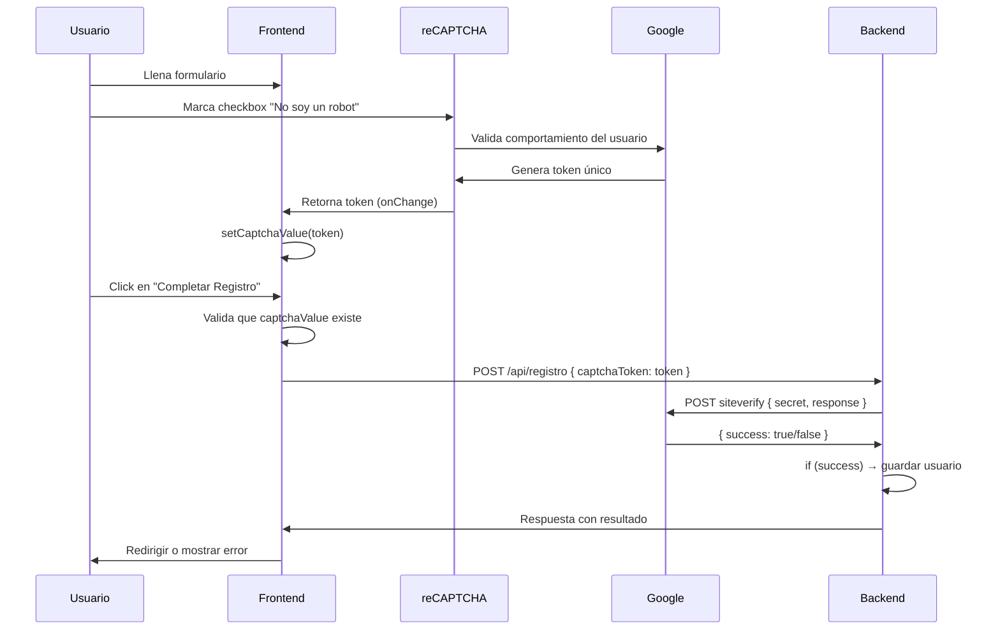

# Implementación Técnica de reCAPTCHA v2

## 📋 Resumen

Sistema de protección anti-bot con verificación de doble capa (frontend + backend) implementado en el formulario de registro.

---

## 🏗️ Arquitectura

### Flujo de verificación completo:



---

## 🔧 Componentes Implementados

### 1. **Frontend** (`app/registro/page.tsx`)

#### Estado del CAPTCHA:
```typescript
const [captchaValue, setCaptchaValue] = useState<string | null>(null)
const recaptchaRef = useRef<ReCAPTCHA>(null)
```

#### Componente reCAPTCHA:
```tsx
<ReCAPTCHA
  ref={recaptchaRef}
  sitekey={process.env.NEXT_PUBLIC_RECAPTCHA_SITE || "6LeIxAcTAAAAAJcZVRqyHh71UMIEGNQ_MXjiZKhI"}
  onChange={(value) => {
    console.log("🔵 CAPTCHA onChange triggered. Value:", value)
    setCaptchaValue(value)
    if (value) {
      setError(null)
      console.log("✅ CAPTCHA completado, error limpiado")
    }
  }}
  onExpired={() => {
    console.log("⚠️ CAPTCHA expiró")
    setCaptchaValue(null)
    setError("El CAPTCHA expiró. Por favor, márcalo nuevamente.")
  }}
  theme="light"
/>
```

#### Validación pre-submit:
```typescript
if (!captchaValue) {
  setError("Por favor, completa el CAPTCHA para continuar")
  return
}
```

#### Envío al backend:
```typescript
const response = await fetch("/api/registro", {
  method: "POST",
  headers: { "Content-Type": "application/json" },
  body: JSON.stringify({
    ...dataToSendWithoutConfirm,
    captchaToken: captchaValue, // 🔒 Token incluido
  }),
})
```

---

### 2. **Backend** (`app/api/registro/route.ts`)

#### Función de verificación:
```typescript
async function verificarCaptcha(token: string): Promise<boolean> {
  const secretKey = process.env.RECAPTCHA_SECRET
  
  if (!secretKey) {
    console.error("❌ RECAPTCHA_SECRET no está configurada")
    return false
  }

  try {
    const response = await fetch("https://www.google.com/recaptcha/api/siteverify", {
      method: "POST",
      headers: { "Content-Type": "application/x-www-form-urlencoded" },
      body: `secret=${secretKey}&response=${token}`,
    })

    const data = await response.json()
    
    console.log("📊 Respuesta de Google reCAPTCHA:", {
      success: data.success,
      challenge_ts: data.challenge_ts,
      hostname: data.hostname,
      error_codes: data["error-codes"],
    })

    return data.success
  } catch (error) {
    console.error("❌ Error al verificar CAPTCHA:", error)
    return false
  }
}
```

#### Validación en el endpoint:
```typescript
export async function POST(request: NextRequest) {
  const data = await request.json()
  const captchaToken = data.captchaToken || data.recaptcha
  
  // 🔒 Verificar CAPTCHA PRIMERO
  if (!captchaToken) {
    return NextResponse.json(
      { error: "Token de CAPTCHA no proporcionado" },
      { status: 400 }
    )
  }

  const captchaValido = await verificarCaptcha(captchaToken)
  
  if (!captchaValido) {
    return NextResponse.json(
      { error: "CAPTCHA inválido o expirado" },
      { status: 400 }
    )
  }

  // Continuar con el registro...
}
```

---

## 🔐 Variables de Entorno

### Desarrollo (`.env.local`):
```bash
# Claves de prueba (siempre pasan el CAPTCHA)
NEXT_PUBLIC_RECAPTCHA_SITE=6LeIxAcTAAAAAJcZVRqyHh71UMIEGNQ_MXjiZKhI
RECAPTCHA_SECRET=6LeIxAcTAAAAAGG-vFI1TnRWxMZNFuojJ4WifJWe
```

### Producción (Vercel):
```bash
# Claves reales de Google reCAPTCHA Admin
NEXT_PUBLIC_RECAPTCHA_SITE=tu_clave_publica_real
RECAPTCHA_SECRET=tu_clave_secreta_real
```

**Importante:**
- `NEXT_PUBLIC_RECAPTCHA_SITE` → Se expone al cliente (segura)
- `RECAPTCHA_SECRET` → Solo en servidor (NUNCA exponer)

---

## 🧪 Testing y Debugging

### Logs del Frontend (consola del navegador):
```
🔵 CAPTCHA onChange triggered. Value: 03AGdBq26PchgiwIXHT...
🔵 Setting captchaValue state to: 03AGdBq26PchgiwIXHT...
✅ CAPTCHA completado, error limpiado
```

Al enviar el formulario:
```
🔍 Verificando CAPTCHA en handleSubmit. captchaValue: 03AGdBq26PchgiwIXHT...
✅ CAPTCHA verificado. Continuando con el registro...
```

### Logs del Backend (terminal/Vercel):
```
🔍 Verificando CAPTCHA con Google...
📊 Respuesta de Google reCAPTCHA: {
  success: true,
  challenge_ts: "2025-10-22T15:30:45Z",
  hostname: "sei-chih.com.mx"
}
✅ CAPTCHA verificado exitosamente
✅ Datos guardados en PostgreSQL
```

### Verificación en Google Admin:
- URL: https://www.google.com/recaptcha/admin
- Revisar: **"Verificaciones totales"** debe incrementar con cada registro
- Gráficas: Muestra solicitudes por día/hora

---

## ❌ Errores Comunes y Soluciones

### 1. "CAPTCHA inválido o expirado"
**Causa:** Token expiró (2 minutos después de marcar el checkbox)  
**Solución:** Implementado `onExpired` que resetea el estado automáticamente

### 2. "Token de CAPTCHA no proporcionado"
**Causa:** Frontend no está enviando `captchaToken` en el body  
**Solución:** Verificar que `body: JSON.stringify({ captchaToken: captchaValue })`

### 3. "RECAPTCHA_SECRET no está configurada"
**Causa:** Variable de entorno falta en Vercel  
**Solución:** Agregar en Vercel → Settings → Environment Variables

### 4. Panel de Google muestra "0 verificaciones"
**Causa:** Backend no está llamando a `siteverify`  
**Solución:** Verificar logs del servidor para confirmar que `verificarCaptcha()` se ejecuta

### 5. "Invalid site key"
**Causa:** Clave pública incorrecta o de otro proyecto  
**Solución:** Copiar exactamente la Site Key del panel de Google reCAPTCHA

### 6. Error de CORS o dominio no permitido
**Causa:** Dominio no agregado en configuración de reCAPTCHA  
**Solución:** Agregar dominio en Google reCAPTCHA Admin → Dominios

---

## 📊 Respuesta de Google siteverify

### Éxito:
```json
{
  "success": true,
  "challenge_ts": "2025-10-22T15:30:45Z",
  "hostname": "sei-chih.com.mx"
}
```

### Fallo:
```json
{
  "success": false,
  "error-codes": [
    "invalid-input-response",
    "timeout-or-duplicate"
  ]
}
```

### Códigos de error comunes:
- `missing-input-secret` → Falta el secret key
- `invalid-input-secret` → Secret key incorrecto
- `missing-input-response` → Falta el token del usuario
- `invalid-input-response` → Token inválido o ya usado
- `timeout-or-duplicate` → Token expiró (>2 minutos)

---

## 🚀 Mejoras Futuras (Opcional)

### 1. Rate Limiting adicional
```typescript
// Limitar intentos por IP
const rateLimit = new Map<string, number>()
const ip = request.headers.get("x-forwarded-for") || "unknown"
if ((rateLimit.get(ip) || 0) > 5) {
  return NextResponse.json({ error: "Demasiados intentos" }, { status: 429 })
}
```

### 2. reCAPTCHA v3 (invisible)
- No requiere interacción del usuario
- Asigna un score de 0.0 a 1.0 según probabilidad de ser bot
- Más fluido pero menos control visual

### 3. Honeypot field adicional
```tsx
<input
  type="text"
  name="website"
  style={{ display: "none" }}
  tabIndex={-1}
  autoComplete="off"
/>
```
Si un bot llena este campo, rechazar el registro.

---

## ✅ Checklist de Implementación

- [x] Instalar `react-google-recaptcha`
- [x] Obtener claves de Google reCAPTCHA Admin
- [x] Configurar variables de entorno (NEXT_PUBLIC_RECAPTCHA_SITE, RECAPTCHA_SECRET)
- [x] Agregar componente ReCAPTCHA en formulario
- [x] Implementar validación en frontend
- [x] Enviar token al backend
- [x] Implementar función `verificarCaptcha()` en backend
- [x] Validar token antes de procesar registro
- [x] Agregar logs de debugging
- [x] Probar en desarrollo con claves de prueba
- [x] Configurar claves reales en Vercel
- [x] Verificar contador en Google Admin
- [x] Documentar implementación

---

## 📚 Referencias

- Google reCAPTCHA Admin: https://www.google.com/recaptcha/admin
- Documentación oficial: https://developers.google.com/recaptcha/docs/verify
- react-google-recaptcha: https://github.com/dozoisch/react-google-recaptcha
- Verificación de sitios: https://www.google.com/recaptcha/api/siteverify

---

✅ **Sistema completamente implementado y funcional**
